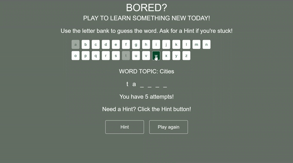
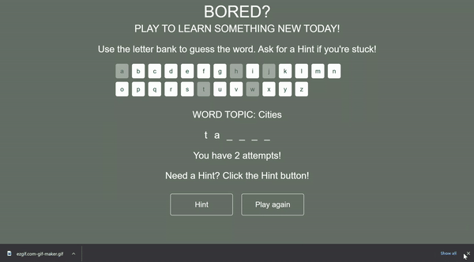

# Bored? (The Game)
## Project Philosophy
Everyone should be able to learn something while having fun. If you want to be ready for a random game of jeopardy, this is the app for you!

## Features
1. An interactive game of hangman. Click letters to try and guess the word.
2. A completed word returns a random (and often insightful) fact.
3. Failure returns a prompt to try again.
4. Clickable 'Hint' button.
5. Attempt counter display.

## How to Play
1. Click a letter to test if it belongs in the hidden word.
   
2. Be careful, you only have five attempts. 
   
3. Don't be shy, use a hint! 
   
4. If you win, you get to learn something new!
   
## Resources & Technologies Used
- [Random Useless Facts: HTTP API for Useless Facts](https://support.west-wind.com)
- [How to read a JSON file from a URL in JavaScript](https://www.educative.io/edpresso/how-to-read-a-json-file-from-a-url-in-javascript)
- [How to add GIFs to your GitHub README](https://josephcardillo.medium.com/how-to-add-gifs-to-your-github-readme-89c74da2ce47)

NOTE: This app is a single page application (SPA) 